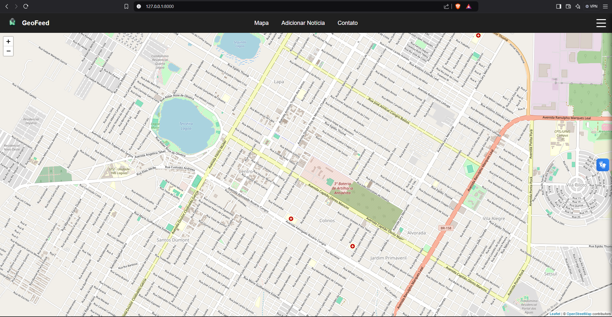
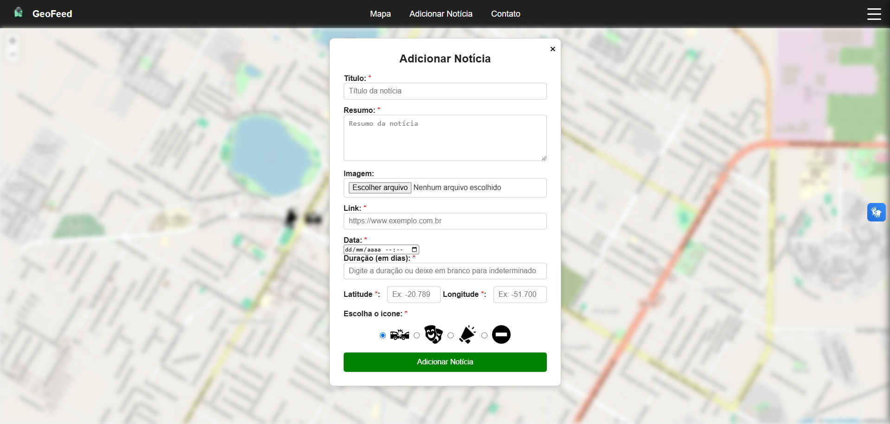
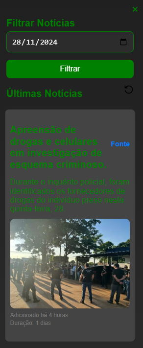
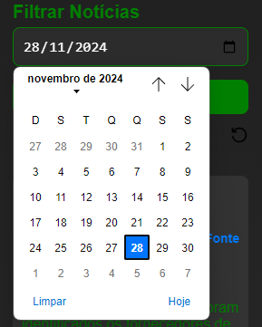
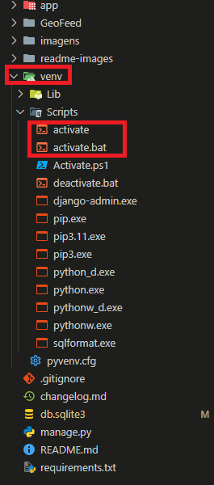
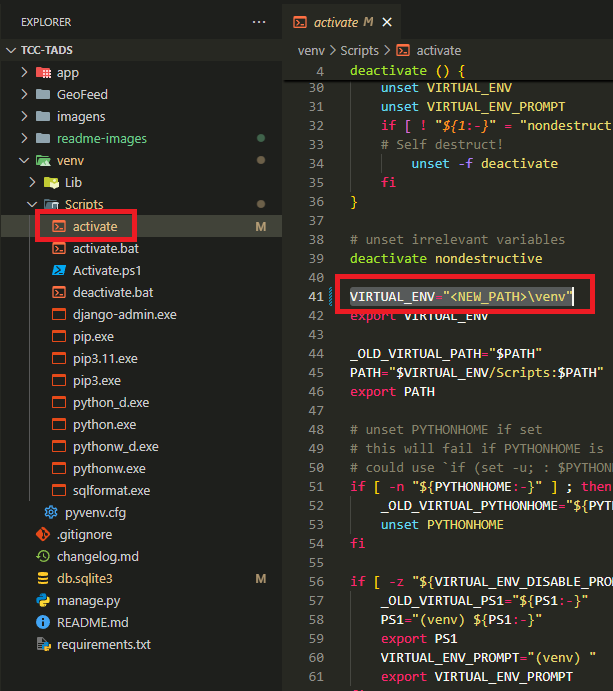
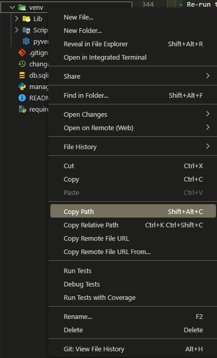

# **APPLICATION FOR NEWS OPTIMIZATION AND HIGHLIGHTING CURRENT ENTERTAINMENT.**

- Here's the link for the PDF file of the article.

<a href="https://drive.google.com/file/d/1tlXNxpa4S3-iGcgFOuw6RQy_Ta01G-RI/view?usp=sharing" target="_blank">
  
</a>


# **How to Clone a GitHub Repository**

## **Install Git:**

- If you don’t already have Git installed, download and install it from git-scm.com.

## **Open Terminal or Windows Powershell:**

- On Windows, use Command Prompt or Git Bash.
- On macOS and Linux, you can use Terminal.

## **Access GitHub and find the repository:**

- Open GitHub in your browser.
- Navigate to the repository you want to clone.

## **Copy the repository URL:**

- Click on the green **Code** button.
- Select HTTPS or SSH (if you have SSH set up) and copy the URL.

## **Navigate to your local directory:**

- In your terminal or command prompt, navigate to the directory where you want to clone the repository by using the cd command.

## **Run the git clone command:**

### **In the terminal, type the following command and paste the repository URL:**

- git clone https://github.com/peehpimentel/tcc-tads.git

Done! Your repository will be cloned to your local machine. You can now navigate to the repository folder with cd <repository-folder>.

# How to install all dependencies for the application

## **First Method: Install Dependencies Individually** 

### **Install Python 3:**

- Download Python from the official website: python.org.
- During installation, ensure you check the box "Add Python to PATH".
- Verify the installation with: python --version

### **Verify if Pip is installed:**

- Pip usually comes pre-installed with Python. Verify with: pip --version
- If not installed, follow the pip installation guide.

### **Create and activate the virtual environment:**

- Virtual environments allow you to isolate Python projects, create with:
  ```bash
  - python -m venv DesiredVirtualEnvironmentName
  ```
- Activate with: 
  - **Windows**:
    ```bash
    .\venv\Scripts\activate
    ```
  - **macOS/Linux**:
    ```bash
    source venv/bin/activate
    ```
### **Install Django**

- pip install django
- Verify with: python -m django --version

### **Install Pillow**

- Pillow is required for image processing in Django install with: pip install pillow
- Verify Pillow installation with: python -m PIL

### **Run Django Server**

- First you need to make migrations of all changes with: python manage.py makemigrations
- Apply those migrations: python manage.py migrate
- Run server: python manage.py runserver
- Open your browser and navigate to [http://localhost:8000/](http://localhost:8000/) or [http://127.0.0.1:8000/](http://127.0.0.1:8000/)

Done! You’ve successfully installed Python, Django, and Pillow, and can now use our application.

## **Second Method: Install All Dependencies at once from requirements.txt**

### **Create the virtual environment:**

- python -m venv DesiredVirtualEnvironmentName

### **Ensure you’re in your virtual environment created before:**

- **Windows**: .\venv\Scripts\activate
- **macOS/Linux**: source venv/bin/activate

### **Install all dependencies:**

- Run this command to install all dependencies: pip install -r requirements.txt
- After installed all dependencies make django migrations with python manage.py makemigrations
- Migrate all the changes with python manage.py migrate
- Run django server with python manage.py runserver
- Open your browser and navigate to [http://localhost:8000/](http://localhost:8000/) or [http://127.0.0.1:8000/](http://127.0.0.1:8000/)

# **STEP-BY-STEP GUIDE TO USE THE MAP**

## **1. Opening the Program**

- After navigating to [http://localhost:8000/](http://localhost:8000/) or [http://127.0.0.1:8000/](http://127.0.0.1:8000/), you will find:
  - The interactive map in the center of the screen.
  - A button to open the **drawer** (sidebar menu) containing recent news.
  - A button to add new news items to the map.
  - A button to access the contact page.



## **2. Exploring the Map**

- The map displays markers representing events or news.
- **Interacting with markers**:
  - Click on a marker to open a popup with details about the news.
  - The popup displays:
    - **News Title**.
    - **Summary**.

## **3. Adding News**

- Click on the **"Add News"** button in the navigation bar.
- The form will appear with the following fields:
  - **Title**: (Requeried) The name of the news or event.
  - **Summary**: (Requeried) A brief description of the news.
  - **Image**: (Optional) Upload a relevant image for the news.
  - **Link**: (Requeried) Add an external link for more information.
  - **Date**: (Requeried) The start date when the news becomes relevant.
  - **Duration**: (Requeried) The number of days the news should be displayed on the map.
  - **Latitude and Longitude**: (Requeried) The coordinates of the event.
  - **Icon**: (Requeried) Choose an icon to represent the news on the map.
- Click **"Add"** to save the news.
- The map will automatically update, showing the new marker at the selected position.



## **4. Navigating the Drawer (Sidebar Menu)**

- Click the button that looks like a "hamburger" in the top-right corner to open the sidebar menu.
- In the drawer, you will see:
  - **Date Filter Field**:
    - Select a date to filter the news displayed on the map.
    - The map will automatically update to show only the markers relevant to the selected date.
  - **List of Recent News**:
    - Each item displays:
      - **News Title**.
      - **Short Summary**.
      - **Relative Time** (e.g., "Added 2 minutes ago").
  - **Refresh Button**: Reloads the list of news in the drawer.



## **5. Clicking on News in the Drawer**

- When you click on a news item in the drawer:
  - The map will automatically filter to display markers corresponding to the news.
  - The focus will be set on the news marker, regardless of the start date.
  - If the news has a **duration**, the functionality respects the news interval, ensuring the marker is highlighted on the map.

## **6. Filtering News by Date**

- At the top of the drawer, there is a date selection field.
- Select a date to filter the news on the map:
  - Only the markers for the news visible on that day will be displayed.
  - You can click **"Refresh"** to reload the news.



## **7. Customizing the Map**

- **Zoom**:
  - Use the mouse wheel or the zoom buttons on the corner of the map.
- **Drag**:
  - Click and drag to move the map.
- **Clusters**:
  - If many markers are close together, they will be grouped into clusters.
  - Click on a cluster to expand and view individual markers.

## **8. Examples of Usage**

### **Adding News with Duration**
- Add a news item for `01/12/2024` with a duration of `7 days`.
- The marker will be displayed from `01/12/2024` to `07/12/2024`.

### **Filtering for a Date Within the Interval**
- Filter the map for `04/12/2024`.
- Click on the news in the drawer.
- The map will stay on the filtered date and focus on the corresponding marker.

### **Filtering for a Date Outside the Interval**
- Filter the map for `10/12/2024`.
- Click on the news that you added in the drawer.
- The filter will be updated to the news start date (`01/12/2024`).

## **9. System Requirements**
- Recommended browser: **Google Chrome, Firefox, or Edge**.
- Internet connection required to load the maps.

# Possible issues:

If you receive an error like:

```
Fatal error in launcher: Unable to create process using '"<PATH>\venv\Scripts\python.exe"  "<PATH>\venv\Scripts\pip.exe" freeze': The system cannot find the file specified.
```

Follow these steps to resolve the issue:

## Step 1: Edit `activate` and `activate.bat` Files

- Navigate to your virtual environment folder:
   ```
   <YOUR_PROJECT_PATH>\venv\Scripts
   ```


- Open the `activate` and `activate.bat` files with a text editor.
- Look for any references to the old virtual environment path (`<OLD_PATH>\venv`) and update them to the new path:
   ```
   <NEW_PATH>\venv
   ```
   -- Activate file:
  


   -- Activate.bat file:
   

   
- Save the changes.

## Step 2: Restart Your Editor

- Close and reopen your code editor (e.g., VSCode) to ensure the changes are applied properly.

## Step 3: Upgrade `pip`

- Reactivate your virtual environment:
   ```
   .\venv\Scripts\activate
   ```
- Upgrade `pip` to ensure it's working correctly:
   ```
   pip install --upgrade pip
   ```
   
## Step 4: Retry Your Command

- Try running the command again:
  ```
  pip freeze > requirements.txt
  ```

## Step 5: Recreate the Virtual Environment (If Needed)

If the issue persists, create a new virtual environment:

- Create a new virtual environment:
   ```
   python -m venv venv
   ```
- Activate the new virtual environment:
   ```
   <NEW_PATH>\venv\Scripts\activate
   ```
- Reinstall your dependencies using `requirements.txt`:
   ```
   pip install -r requirements.txt
   ```

## Note:

Replace `<OLD_PATH>` with the previous incorrect path and `<NEW_PATH>` with the current correct path for your virtual environment.

-- If you need help finding the path to the file or folder, just right click on the name and then copy or just right click and press SHIFT + ALT + C

  


